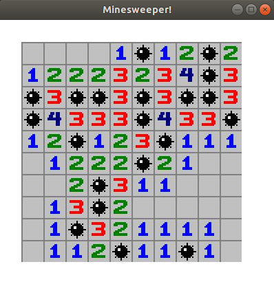
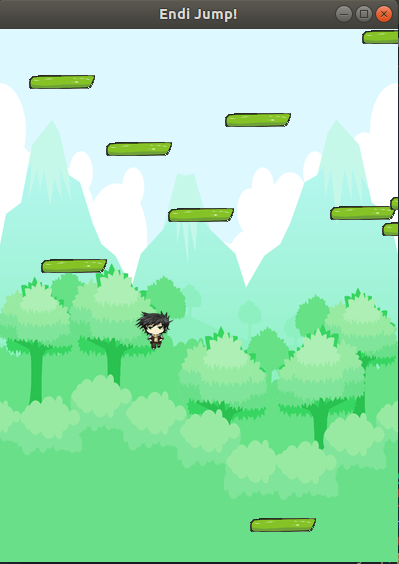
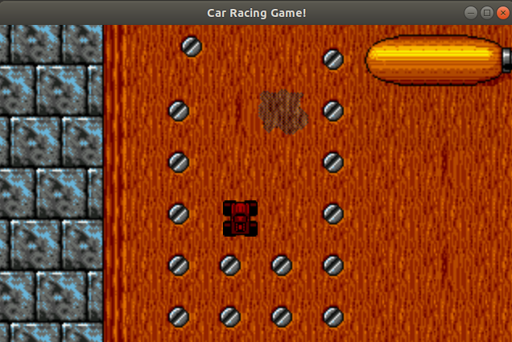

# Description

Collection of simple games made in C++





## Installation

*Ubuntu*

```bash
sudo apt-get install libsfml-dev
```

*Others*

https://www.sfml-dev.org/tutorials/2.5/#getting-started


## Quick Start

Run this command inside one of the game folder
```
sudo chmod +x play.sh
./play.sh
```

Alternatively, you can compile and then run it yourself
```
g++ -std=c++11 -c main.cpp
g++ main.o -o sfml-app -lsfml-graphics -lsfml-window -lsfml-system
./sfml-app
```
